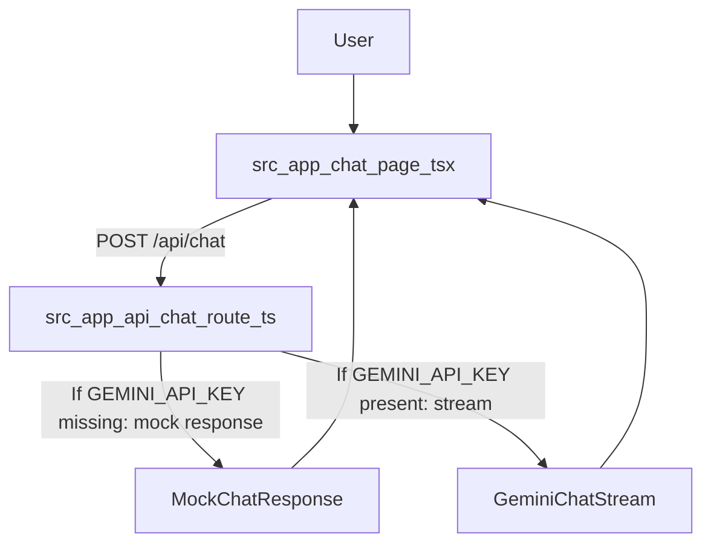
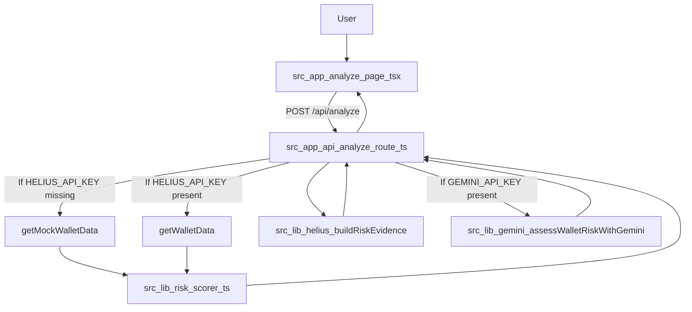
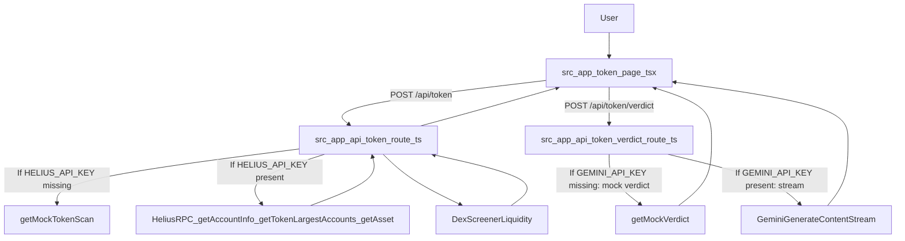

# Architecture

This document is a high-level technical overview of how The Solana Sheriff is structured and how requests flow through the system.

## Tech stack

- **Next.js 14 (App Router)** for UI + server endpoints
- **TypeScript** for type safety
- **Tailwind CSS** for styling
- **Google Gemini** (optional) for chat + AI-generated assessments
- **Helius** (optional) for Solana on-chain data
- **DexScreener** (token liquidity lookup)
- **ElevenLabs** (optional) for text-to-speech

## Repo layout (key paths)

- **UI pages**: `src/app/**/page.tsx`
  - `src/app/page.tsx` (home)
  - `src/app/chat/page.tsx` (AI assistant)
  - `src/app/analyze/page.tsx` (wallet analyzer)
  - `src/app/token/page.tsx` (token scan)
  - `src/app/resources/page.tsx` (education hub)
- **API routes**: `src/app/api/**/route.ts`
- **Core libs**: `src/lib/*`
  - `src/lib/helius.ts`: Solana data fetch + normalization + evidence building
  - `src/lib/risk-scorer.ts`: heuristic wallet risk scoring
  - `src/lib/gemini.ts`: prompts + wallet AI assessment helper
- **Shared types**: `src/types/index.ts`
- **UI components**: `src/components/*`

## End-to-end flows

### Flow 1: AI Safety Assistant (Chat)

The chat UI streams assistant output as plain text.

Key files:

- `src/app/chat/page.tsx` (streams `response.body` to render partial assistant text)
- `src/app/api/chat/route.ts` (Gemini streaming; demo-mode fallback)
- `src/lib/gemini.ts` (`SHERIFF_SYSTEM_PROMPT`, mock responses)

### Flow 2: Wallet Analyzer (Helius + heuristic + optional AI)

Wallet analysis returns a JSON payload including findings, advice, and (optionally) an AI assessment.

Key files:

- `src/app/api/analyze/route.ts` (orchestration + demo mode)
- `src/lib/helius.ts` (`getWalletData`, `getSolBalance`, `buildRiskEvidence`, mocks)
- `src/lib/risk-scorer.ts` (`scoreRisk`)
- `src/lib/gemini.ts` (`assessWalletRiskWithGemini`)
- `src/types/index.ts` (`AnalysisResult`, `RiskEvidence`, `AiAssessment`)

### Flow 3: Scam Token Detector (Helius RPC + DexScreener + optional AI verdict)

Token scan is JSON; “Sheriff’s Verdict” is streamed as plain text.

Key files:

- `src/app/api/token/route.ts` (scan + demo mode)
- `src/app/api/token/verdict/route.ts` (Gemini streaming verdict + demo mode)
- `src/types/index.ts` (`TokenScanResult`)

## See also

- [`docs/features.md`](features.md)
- [`docs/api.md`](api.md)
- [`docs/risk-engine.md`](risk-engine.md)
- [`docs/external-services.md`](external-services.md)
- [`docs/configuration.md`](configuration.md)

